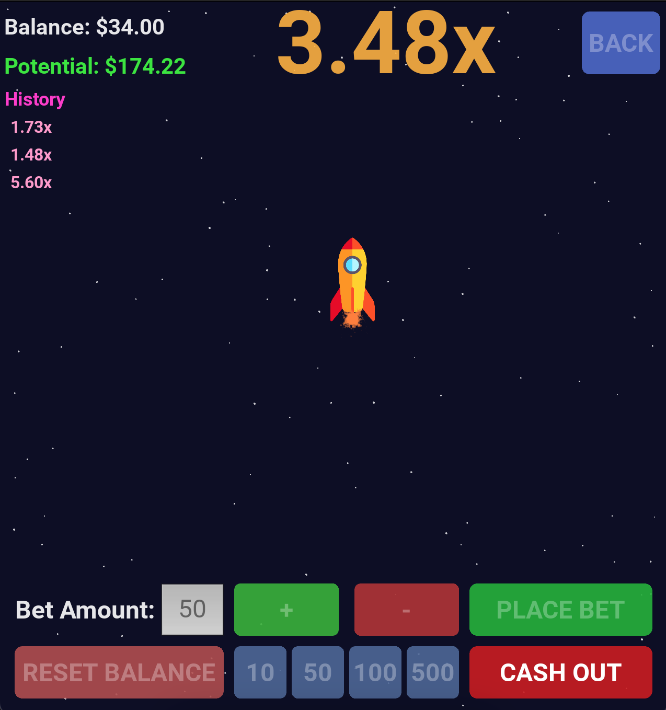
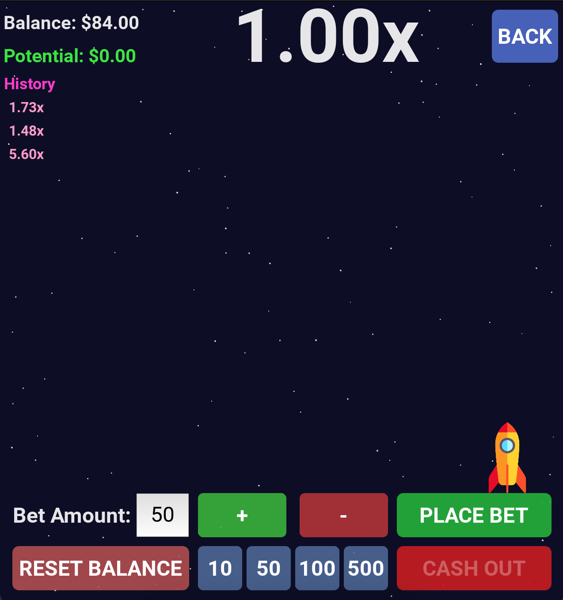
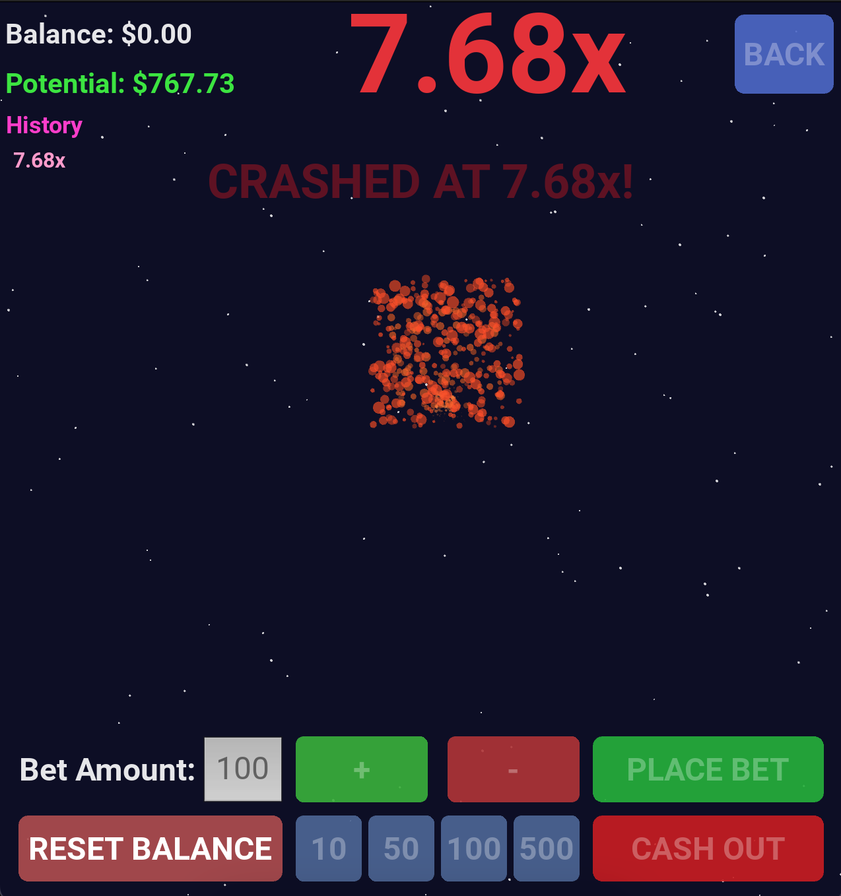
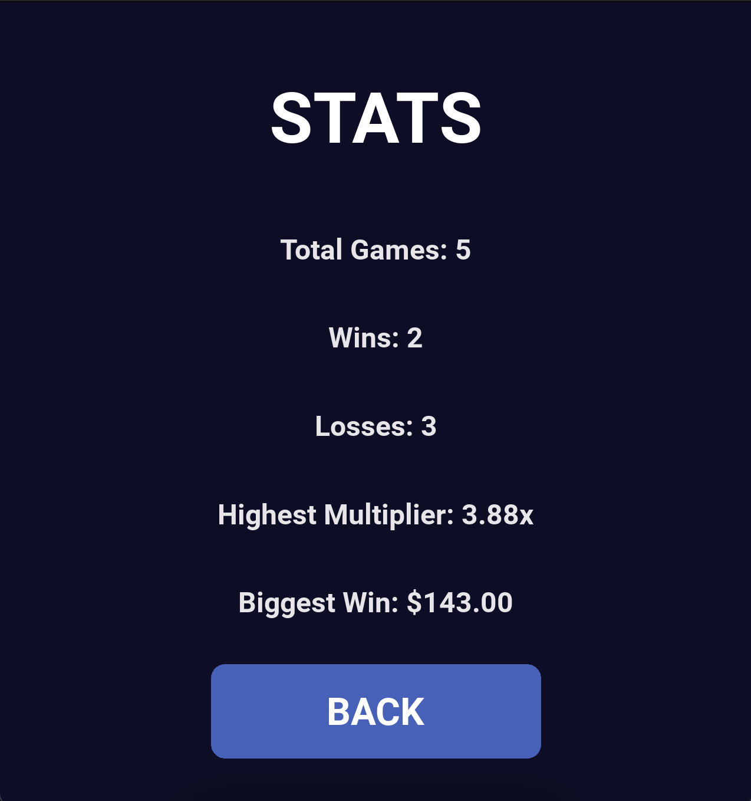

# SHIIIUUUU

## Project Description

This project implements an interactive desktop gambling simulation game built with the Kivy framework, allowing players to place virtual bets on a progressively increasing multiplier represented by a flying rocket that eventually crashes at a pseudo-random point determined by mathematical skewing, delivering smooth 60 FPS performance through optimized particle effects for trails and explosions, integrated audio cues, and persistent statistics tracking, developed as part of interactive software development studies emphasizing game mechanics, real-time graphics rendering, user interface design, and cryptographically seeded random number generation for fair unpredictability.

## Table of Contents

- [Installation](#installation)
- [Usage](#usage)
- [Features](#features)
- [Methodology](#methodology)
- [Results](#results)
- [References](#references)
- [Dependencies](#dependencies)
- [Algorithms/Mathematical Concepts Used](#algorithmsmathematical-concepts-used)
- [License](#license)
- [Acknowledgments](#acknowledgments)
- [Assets Source](#assets-source)
- [Note](#note)

---

## Installation

1. Ensure Python **3.8** is installed on your system.

2. Install project dependencies:

```bash
pip install -r requirements.txt
```

3. The `requirements.txt` should include at least:

```
kivy>=2.2.0
plyer>=2.1.0
```

4. Download the necessary assets (plane_icon.png, bet.wav, cash_out.wav, crash.wav) from the project repository and place them in the root directory.

## Usage

**Important**: Ensure Kivy is properly configured for your operating system, and audio drivers are installed for sound playback.

### Running the Application

1. Open a terminal in the project directory.
2. Run the script:
```python
python shiiiuuuu.py
```
3. Interact with the game via the UI: Navigate the menu, place bets using presets or custom amounts, monitor the multiplier during flight, and cash out manually before the crash to secure winnings; the game resets automatically after each round.

## Features

- **Betting System**: Enforces minimum bets, provides preset options (10, 50, 100, 500), manages player balance with deductions and additions, and disables inputs during active flights to prevent errors.
- **Dynamic Multiplier**: Updates in real-time based on elapsed time, with color changes indicating risk levels (green for low, yellow for medium, red for high).
- **Particle Effects**: Implements a pooling system for up to 800 particles to create realistic smoke trails behind the plane and explosive bursts on crash, with fading opacity and size for visual smoothness.
- **Sound Integration**: Plays distinct WAV files for betting, cashing out, and crashing events, with volume control to enhance immersion.
- **Statistics Tracking**: Persists data on total games, wins, losses, highest multiplier achieved, and biggest win amount via JSON file storage, viewable in a dedicated stats screen.
- **Menu System**: Features a main menu with options for starting the game, viewing stats, credits, and exiting, using Kivy ScreenManager for transitions.
- **Model Persistence**: Automatically saves and loads game statistics to maintain progress across sessions, with reset functionality for balance.

## Methodology

### 1. Asset Loading and Validation

- Load audio files (bet.wav, cash_out.wav, crash.wav) using Kivy's SoundLoader, set volumes to 0.7, and handle loading exceptions gracefully.
- Load plane_icon.png as an Image widget, ensuring it exists in the working directory.

### 2. Constants Configuration

- Define configuration constants for initial balance (100), minimum bet (10), particle limits (800), target FPS (60), crash parameters (max range 15.0, skew 2.5), and special crash chance (0.01) with min/max (10.0-50.0).

### 3. Attributes

- Particle attributes: Track position (x,y), velocity (vx,vy), lifetime, size, and RGBA color, with reset functionality for pooling.
- Game state management: Use Enum for states (MENU, BETTING, FLYING, CRASHED, RESULT) to control UI and logic flow.

### 4. Architecture

- **State Manager**: Manages balance updates, bet placement with validation, multiplier calculation, crash point generation using skewed random, cashout logic with profit computation, and history deque (maxlen=5) for recent results.
- **Game Engine**: Controls plane positioning along the precomputed path, determines multiplier display color based on thresholds, and handles resets post-round.
- **Particle Pool**: Allocates from a fixed list of 800 particles, emitting batches with randomized velocity, lifetime, size, and color for effects like trails and explosions.
- **UI Components**: Utilizes Kivy screens (StartScreen, GameScreen, StatsScreen, CreditsScreen), styled buttons and inputs with rounded rectangles, labels for dynamic text, and Clock scheduling for updates.

### 5. Management

- Use Kivy Clock to schedule game updates at 1/60 seconds for 60 FPS consistency.
- Employ hashlib.sha256 with time and random seeds for reproducible yet unpredictable crash points.

### 6. Evaluation

- Test for frame rate stability during high particle emissions (e.g., 400 on crash).
- Validate cooldowns (0.5 seconds) on buttons to avoid duplicate actions.
- Ensure balance and stats integrity across multiple game cycles.

| *Sample Game Play* |
|:--:|
|  |

| *Sample Game Screen* |
|:--:|
|  |

| *Sample Crash Screen* |
|:--:|
|  |

| *Sample Stats Screen* |
|:--:|
|  |

## Results

### Performance Summary

| Model | Update Rate | Max Particle Count | Audio Latency | Stats Persistence | Memory Usage |
|-------|-------------|--------------------|---------------|-------------------|--------------|
| Game Engine | 60 FPS | 800 | Low (<50ms) | JSON-based | Moderate |
| Particle System | Real-time | Variable (75-400 per emit) | N/A | N/A | Optimized via pooling |
| State Manager | Event-driven | N/A | N/A | Reliable across sessions | Low |
| UI Renderer | Smooth transitions | N/A | N/A | N/A | GPU-accelerated |

### Event Analysis

- Crashes: Occur at skewed random points, leading to full bet losses if not cashed out, with special high-multiplier events at 1% chance.
- Edge cases: Betting disabled at low balance; particle overflows prevented by pool limits.

### Robustness Testing

- Maintains 60 FPS on standard desktop hardware even during particle-intensive crashes.
- Handles rapid state changes without memory leaks over extended play sessions.
- Performs reliably with varied bet amounts and frequent resets, ensuring no data corruption in stats.

## Dependencies

- kivy>=2.0.0
- plyer>=2.1.0

## Algorithms/Mathematical Concepts Used

### 1. Crash Point Generation

- **Formulation**:  
  $$crash\\_point = 1.0 + (raw^{CRASH\\_SKEW}) \times CRASH\\_MAX\\_RANGE$$
- Incorporates a small chance for special high values: uniform between SPECIAL_MIN and SPECIAL_MAX; seeded with SHA256 for security and fairness.

### 2. Multiplier Growth

- **Formulation**:  
  $$multiplier = 1.0 + GROWTH\\_FACTOR \times (elapsed^{GROWTH\\_EXPONENT})$$
- Provides exponential growth to simulate increasing risk over time, checked against crash point each frame.

### 3. Particle Dynamics

- **Update Equation**:  
  $$x = x + v\\_x \times dt \times 60$$  
  $$y = y + v\\_y \times dt \times 60$$  
  Fade: $$a = initial\\_a \times (lifetime / max\\_lifetime)$$  
- Ensures consistent motion across frame rates with linear interpolation and decay.

### 4. Flight Path Generation

- **Sinusoidal Trajectory**:  
  $$y = base\\_y + 75 \times \sin((t - 0.15) \times 15)$$
- Parametric sampling over t from 0 to 1, with initial linear ascent for realism.

### 5. Hash Seeding

- Uses SHA256 digest of timestamp plus random float for seed, ensuring non-predictable yet verifiable randomness.

### 6. Cooldown Mechanism

- Boolean flags toggled with scheduled resets after 0.5 seconds to debounce user inputs.

### 7. Color Interpolation

- Threshold-based: <2.0 green, <5.0 yellow, >=5.0 red, for intuitive risk visualization.

## References

1. Kivy Framework Documentation. (2023). *Kivy: Cross-platform Python Framework for NUI Development*. Available at: https://kivy.org/doc/stable/.
2. Python Standard Library. (2023). *hashlib, random, and time modules*.
3. Nystrom, R. (2014). *Game Programming Patterns*. Genever Benning. (Chapter on Object Pools for particles).
4. Millington, I. (2009). *Artificial Intelligence for Games*. Morgan Kaufmann. (Sections on random number generation in simulations).

## Assets Source

Assets: plane_icon.png (custom or placeholder icon), sounds sourced from WavSource.com or similar free repositories.
- **Format**: WAV for audio, PNG for images
- **Size**: Small files (<1MB total)

## License

This project is licensed under the MIT License - see the [LICENSE](LICENSE) file for details.

## Acknowledgments

- Kivy community for the open-source UI framework and extensive documentation
- Sound sources: WavSource.com for providing free audio clips

## Note

| Inline comments in code are lowercase as per style. |
|:--:|
